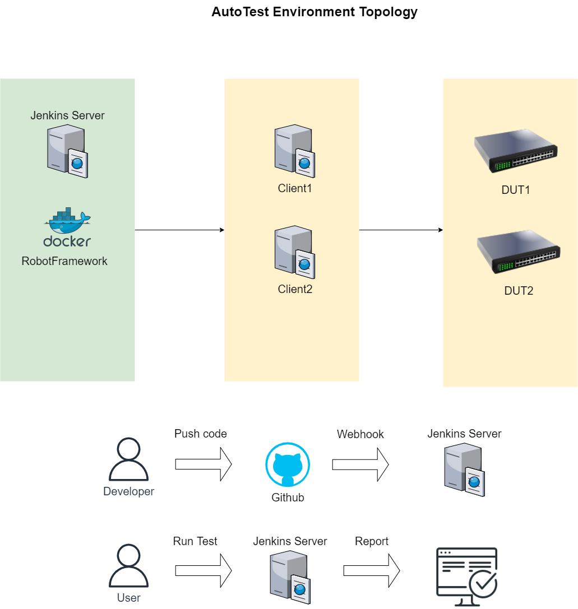
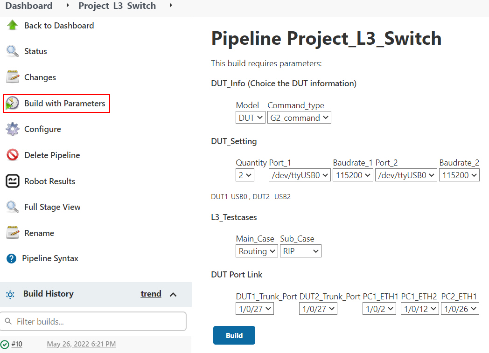
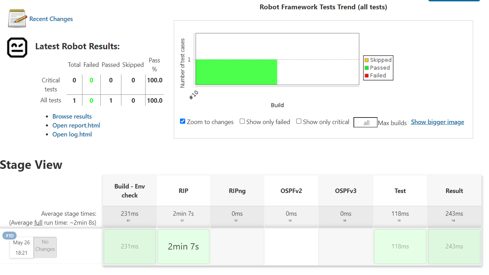
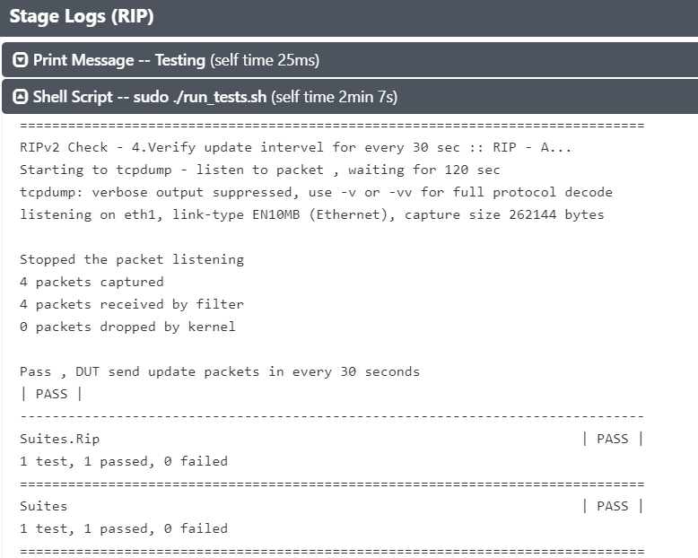
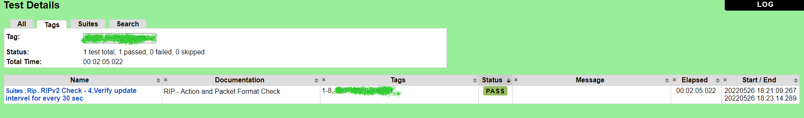
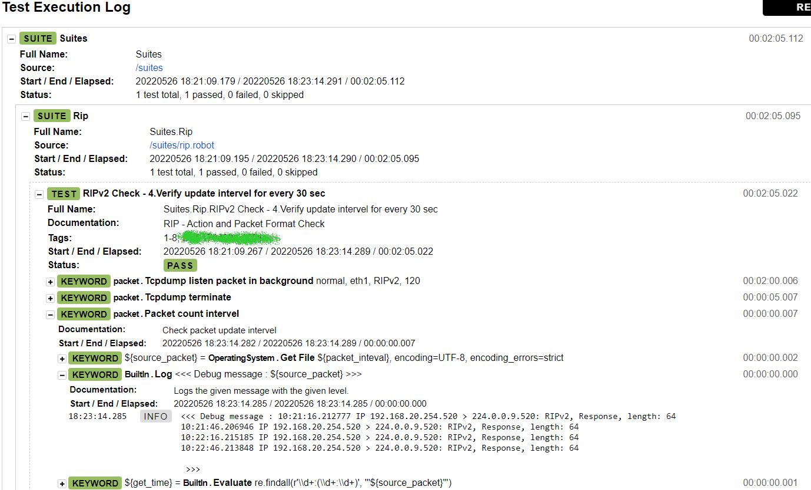

# Switch_Test

* ### About the Project
  搭配Jenkins + Robotframework 系統開發
  * 利用CI(Continuous integration)持續整合的功能
  
    ### 程式建置
    開發人員在每一次的Commit&Push,都能在統一的環境Docker container執行程式,避免環境不同造成相容性問題
  
    ### 測試程式
    上傳前除了在本機測試好之外,也可以透過步驟加入自動測試的功能,多了一個雙重驗證,或是利用排程測試

  * CD(Continuous Deployment)持續佈署
    透過自動化的方式,將設計好的程式碼佈署到各個測試伺服器,方便統一使用,減少人工作業

--------------
* ### Topology
  
  
  
* ### Run
  
  * Build with parameters
    
  
  * Jenkins stage
    
   
  * Jenkins stage log
    
  
    
* ### Result
  * jenkins robotframework report
    
  
  * jenkins robotframework log - for debug
    
  

  
